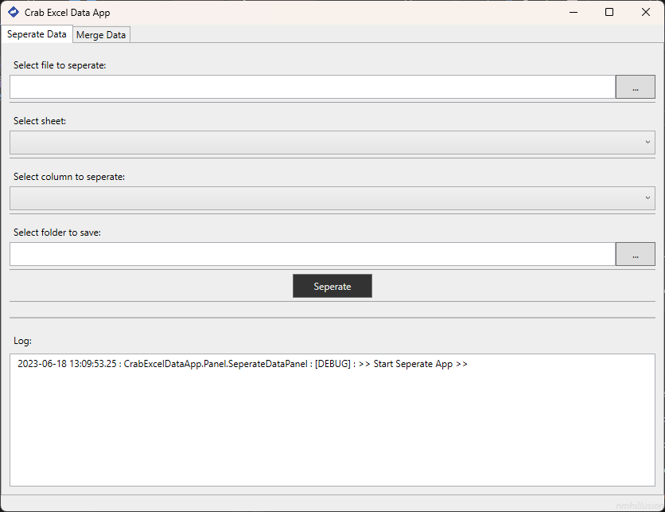
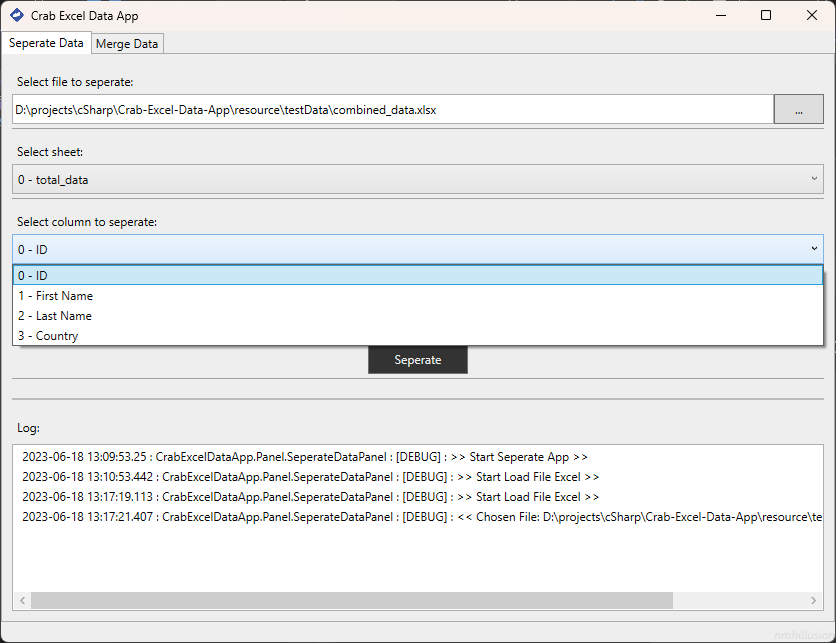
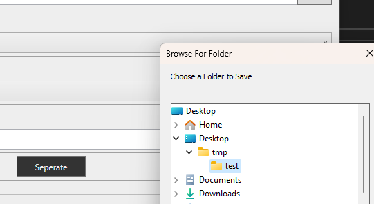
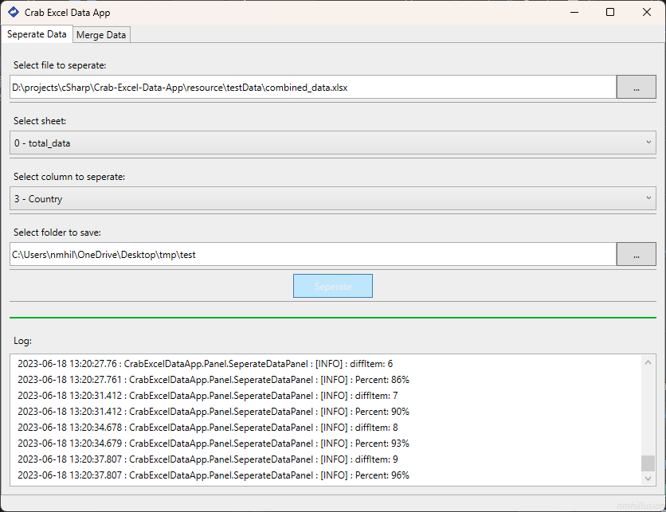
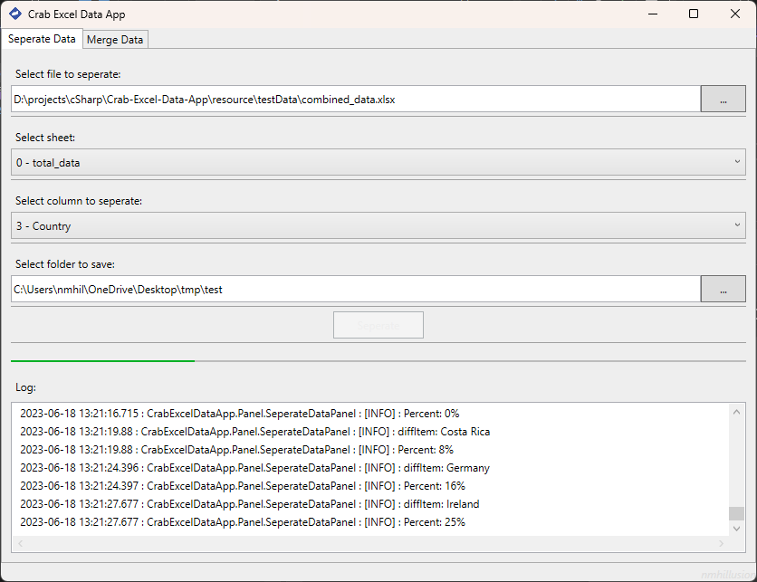
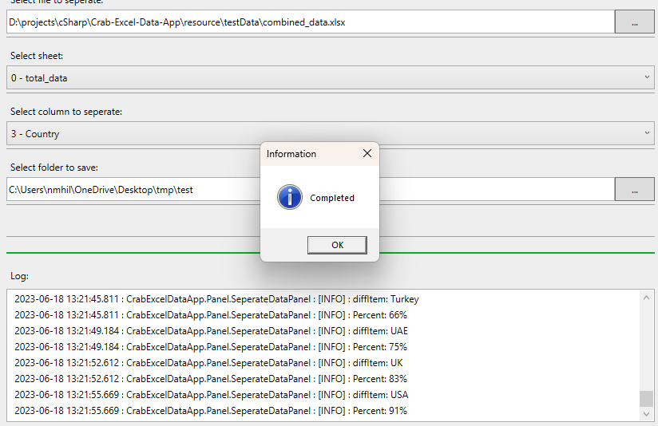
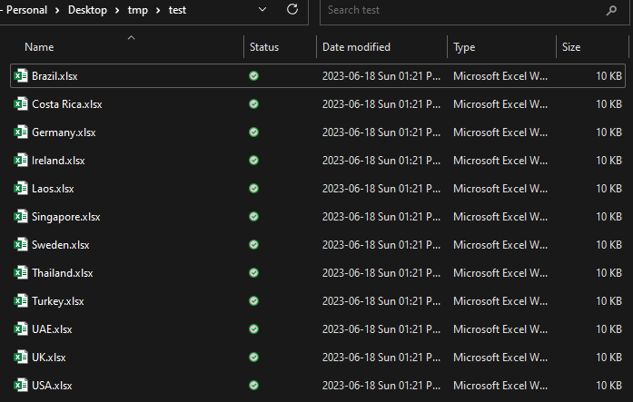
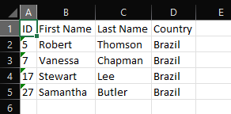

# Crab Excel Data App

## Merge Data

Template Data:

Parts of data to merge:

[/] Part 1:

- Sheet1

[/] Part 2:

- Sheet1

- Sheet2

> Step by step:

--

Output folder with result file is created `combined_data.xlsx`

And, content of this file will be look like...

## Seperate Data

---

Test Data will look like:

Step by step:

Result folder:

in result of `Brazil` country file:

