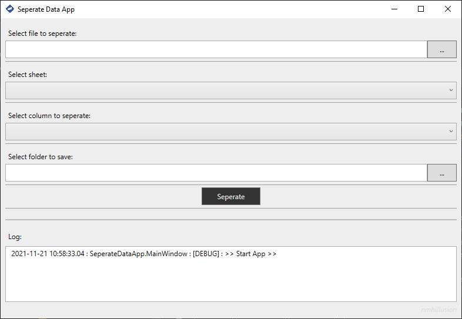
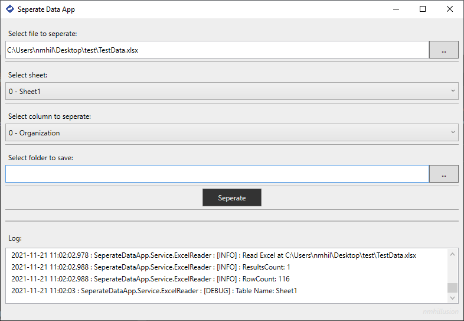
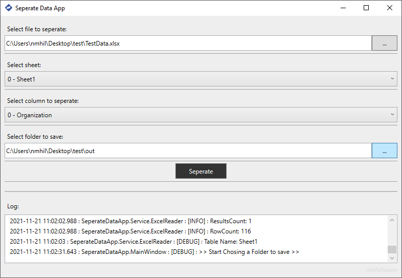
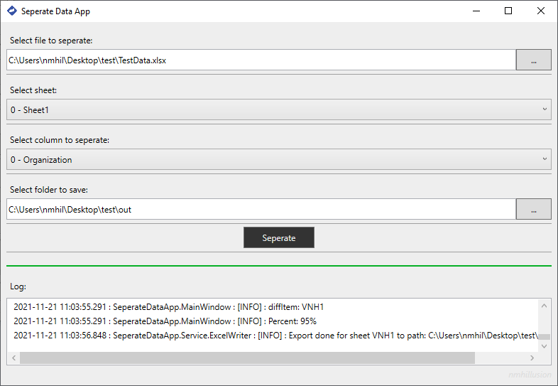

# Seperate Data App

---

> Step 1: Open App

> Step 2: Select file to seperate and select filter to seperate

> Step 3: Select folder to save outputs

> Step 4: Click `Seperate` button and Running seperation

> Finally: Complete and check your saved folder

