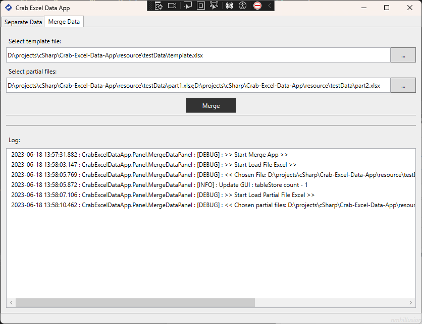

# Crab Excel Data App

App to help:

- separate data from a total excel to specific values based on a critical column.
- merge data from partial excel files with the same template.

> Demo data files in path: [link](./resource/testData/)

## Merge Data

---

Template Data:

Parts of data to merge:

_Part 1:_

- Sheet1

_Part 2:_

- Sheet1

- Sheet2

**Step by step:**

select template file and partial excel files to merge. Then click on button `Merge` to start execution and waiting for completion

choose a file to save the combined data

now, it's completed

**Result**

Output folder with result file is created `combined_data.xlsx`

And, content of this file will be look like...

## Separate Data

---

Test Data will look like:

**Step by step:**

then, select a folder to save the results

click button `Seperate` to start execution

and waiting to complete

now, it's completed

**Result**

Result folder:

in result of `Brazil` country file:

